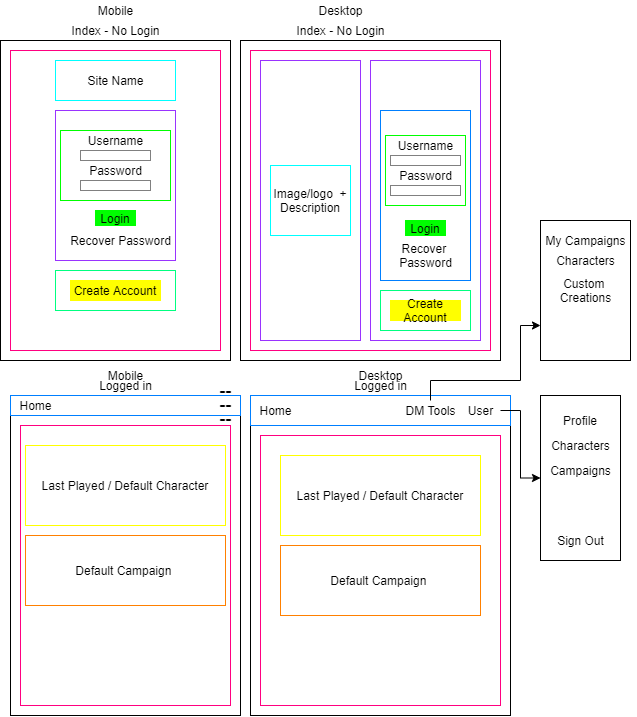
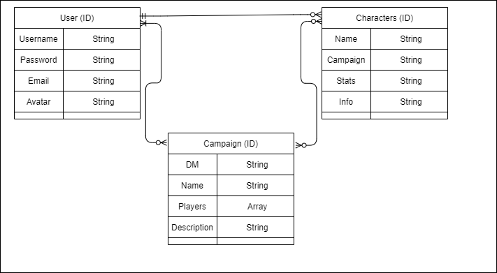

# Unnamed
An unnamed DnD canpaign mangemt site. 
## Screenshots

## Technologies Used
    - HTML
    - CSS
    - JavaScript
    - MongoDB / Mongoose
    - Express
    - EJS
    - Method-Override
    - DOTENV
    - (Eventually) DnD 5e API [LM](http://www.dnd5eapi.co/docs/)

## Getting Started
(Update when project has a name)
[Link](https://shielded-plateau-48899.herokuapp.com/) to the site.

## Next Steps [Trello](https://trello.com/b/qQv2ZnQL/project-2)
- Give more functionality for the GM
- Implement more functionality for campaigns
- Expand Profiles
- API integration
- LOTS of UX
- Logic Checks (Is this a good enough password etc...)
- Change the style?? Criticism Wanted
- Password Recovery
- Email Verification

